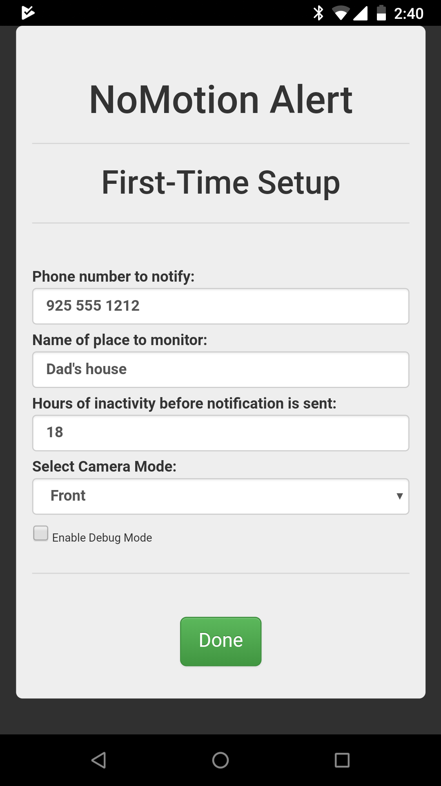

# NoMotion-Alert
Originally created for DHS Hackathon 

# Problem
Do you have an eldery relative who lives alone? Do you wonder if that person is doing ok? Have they fallen and can't get up? 

# Solution
Install this app in the old phone, plug it in and put it somewhere frequently visited by your relative in the house (like the kitchen), leave it permanently plugged in and have it text you if no one has entered that room for a long time. 

# Requirements
Very old iPhone Android phone. Wi-Fi internet connection (note no cellular service is required).

